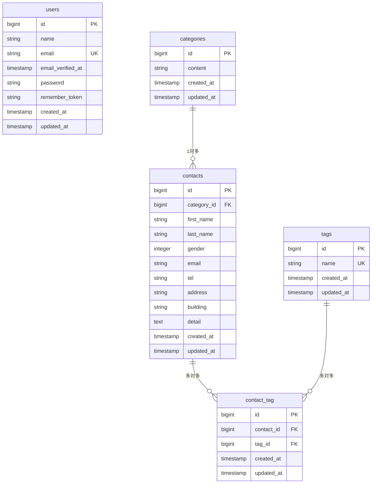

# COACHTECH お問い合わせフォーム

## 概要
本プロジェクトは、COACHTECH確認テストの要件に沿って構築されたお問い合わせ管理システムです。
一般ユーザー向けのお問い合わせ入力・確認・送信・完了画面をはじめ、管理者向けのお問い合わせ管理（一覧・検索・詳細・削除）、タグ管理（CRUD）、CSV出力機能、および公開APIを提供します。

## ER図

## 環境構築手順
1. リポジトリのクローン
git clone git@github.com:mimikumanoo-ui/contact-form-app.git
cd contact-form-app

2. 環境変数の設定
cp .env.example .env

3. Dockerコンテナの起動
./vendor/bin/sail up -d

4. アプリケーションキーの生成
sail artisan key:generate

5. マイグレーションおよびシーディングの実行
sail artisan migrate:fresh --seed

## 使用技術
- PHP 8.2
- Laravel 10.x
- MySQL 8.0
- Webサーバー: Nginx
- フロントエンド: Vite, Tailwind CSS ^3.4.0
- 開発ツール: Docker, Laravel Sail, phpMyAdmin

## APIエンドポイント一覧
- GET /api/v1/contacts : お問い合わせ一覧取得
- POST /api/v1/contacts : お問い合わせ作成
- GET /api/v1/contacts/{id} : お問い合わせ詳細取得
- PUT /api/v1/contacts/{id} : お問い合わせ更新
- DELETE /api/v1/contacts/{id} : お問い合わせ削除

## 開発環境URL
- WEB: http://localhost
- phpMyAdmin: http://localhost:8080

## 作成者
戸澤美優